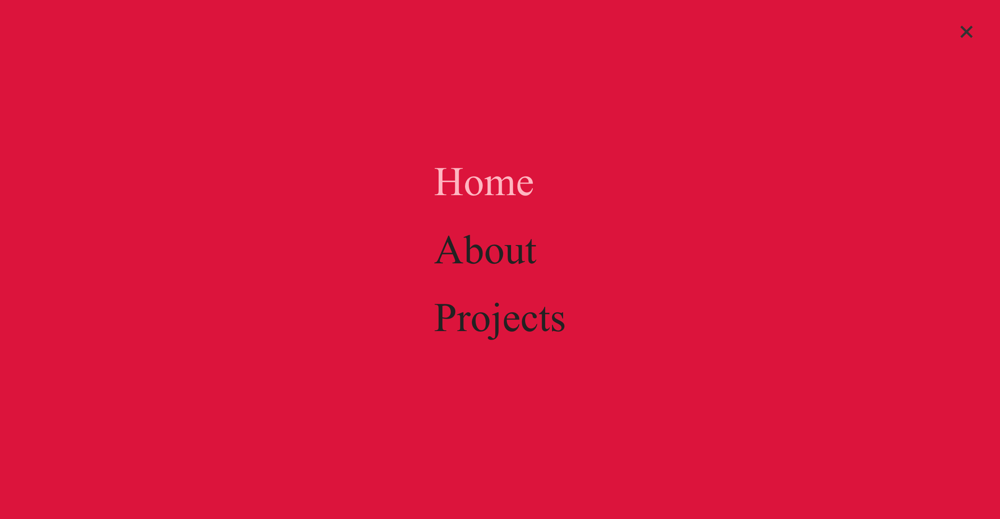
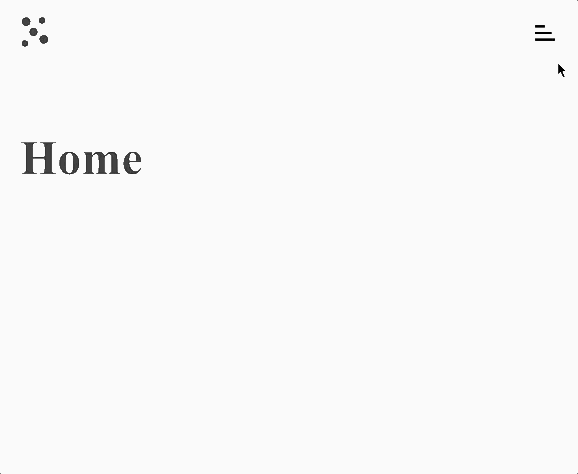

# Mobile navigation

Let's create a website with navigation.
The site must have 3 pages: home, about and projects.
No need to add any extra content, it is enough each page to display just a title (the name of the page), for example:

The website should have a navigation menu, which is initially hidden behind a burger icon. On click on the icon, the menu is displayed and the current page is highlighted:

The highlighted menu item, should have no hover effect.
The menu items which are not currently active, should have hover effect.

On click on the menu items, the corresponding page is loaded, and the URL is updated.

In addition, on click on the logo, the Home page is displayed.

In case the user is trying to access a route that does not exist, display a 404 page.

> Use [React Router](https://reacttraining.com/react-router/web/guides/quick-start) for this exercise
